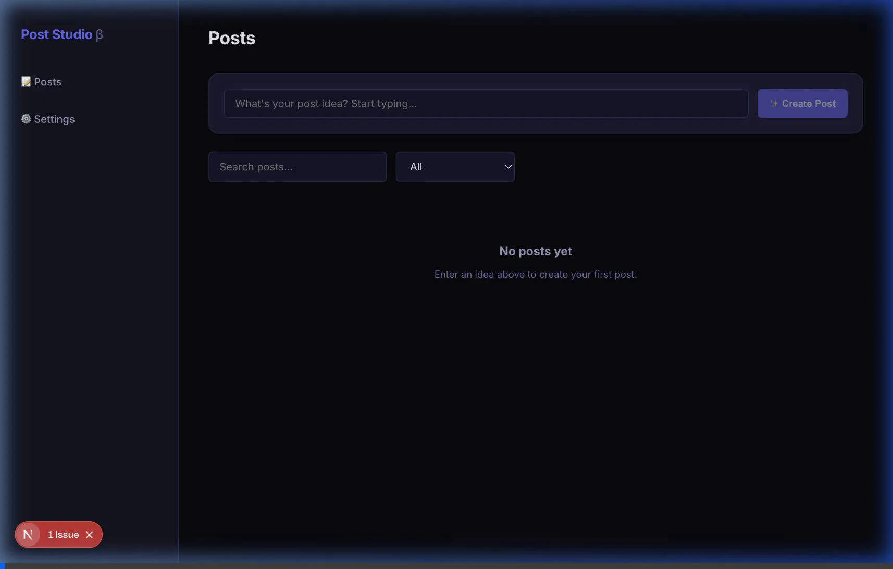

<div align="center">

# 📮 Afterposten. AI Studio

**AI-powered LinkedIn post creation, scheduling, and publishing — as a desktop app.**

[](https://github.com/scrobot/afterposten/actions/workflows/ci.yml)
[](https://github.com/scrobot/afterposten/releases)
[](LICENSE)

_From idea to published LinkedIn post in minutes, not hours._

</div>

---

## ✨ What is this?

Afterposten is a **local-first desktop app** that turns rough ideas into polished LinkedIn posts using AI. Write an idea, generate multiple draft variants, pick your favorite, attach an AI-generated image, schedule it, and publish to LinkedIn via n8n webhooks — all from one clean interface.

**No cloud accounts. No subscriptions. Your data stays on your machine.**

<div align="center">



_Create → Generate → Edit → Schedule → Publish_

</div>

## 🚀 Features

| Feature                      | Description                                                                                                   |
| ---------------------------- | ------------------------------------------------------------------------------------------------------------- |
| 💡 **Idea → Draft**          | Paste an idea, AI generates a full LinkedIn post with hook, body, CTA, and hashtags                           |
| 🔄 **Variant Generation**    | Get 3–5 different angles on the same idea, pick the best one                                                  |
| 🖼️ **AI Image Generation**   | Generate post images with style presets (clean-tech, editorial, bold-minimal, etc.)                           |
| #️⃣ **Smart Hashtags**        | AI suggests 5–15 relevant hashtags based on your content                                                      |
| 🎙️ **Voice Input (STT)**     | Speech-to-text via Whisper — speak in any language, get English text for ideas and knowledge base             |
| 📅 **Scheduling**            | Set a date/time in your timezone, the scheduler handles the rest                                              |
| 🔌 **n8n Integration**       | Publish via webhook with multipart/form-data — text, image, metadata                                          |
| 🔒 **Encrypted Credentials** | Publisher auth tokens encrypted at rest (AES-256-GCM)                                                         |
| 🧠 **Knowledge Base (RAG)**  | Embedded Vectra vector DB for voice/style context — add URLs, text docs, or let it auto-learn from your posts |
| ⚡ **Real-time Streaming**   | Watch the AI draft appear word-by-word as it generates                                                        |
| 🖥️ **Desktop App**           | Runs as a native Electron app on macOS, Windows, and Linux                                                    |

## 🏗️ Architecture

```
┌─────────────────────────────────────────────────────┐
│                    Electron Shell                    │
│  ┌───────────────────────────────────────────────┐  │
│  │              Next.js (App Router)              │  │
│  │  ┌─────────┐  ┌──────────┐  ┌─────────────┐  │  │
│  │  │  Posts   │  │ Settings │  │  Post Editor │  │  │
│  │  │  List    │  │   Page   │  │  + AI Panel  │  │  │
│  │  └────┬────┘  └────┬─────┘  └──────┬──────┘  │  │
│  │       │             │               │          │  │
│  │       └─────────────┼───────────────┘          │  │
│  │                     ▼                          │  │
│  │              API Routes (13)                   │  │
│  │       ┌─────┬──────┬───────┬──────┐           │  │
│  │       │ AI  │ Pub  │ Sched │ CRUD │           │  │
│  │       └──┬──┴──┬───┴───┬───┴──┬───┘           │  │
│  │          │     │       │      │                │  │
│  │          ▼     ▼       ▼      ▼                │  │
│  │       OpenAI  n8n   Poller  SQLite    Vectra   │  │
│  │        API   Webhook        (Prisma)  (RAG)    │  │
│  └───────────────────────────────────────────────┘  │
└─────────────────────────────────────────────────────┘
```

## 📥 Installation

### Download (Recommended)

Grab the latest release for your platform from [**Releases**](https://github.com/scrobot/afterposten/releases):

| Platform              | Format                           |
| --------------------- | -------------------------------- |
| macOS (Apple Silicon) | `.dmg` / `.zip`                  |
| macOS (Intel)         | `.dmg` / `.zip`                  |
| Windows               | `.exe` (NSIS installer) / `.zip` |
| Linux                 | `.AppImage` / `.deb`             |

### Build from Source

```bash
# Clone the repo
git clone https://github.com/scrobot/afterposten.git
cd afterposten

# Install dependencies
pnpm install

# Set up the database
pnpm db:migrate

# Configure environment
cp .env.example .env
# Edit .env with your OpenAI API key and encryption key
```

## ⚙️ Configuration

Create a `.env` file in the project root:

```env
# Required: Your OpenAI API key
OPENAI_API_KEY=sk-...

# Required: 64-char hex string for encrypting publisher credentials
# Generate one: node -e "console.log(require('crypto').randomBytes(32).toString('hex'))"
ENCRYPTION_KEY=your-64-char-hex-string

# Optional: Database location (defaults to file:./dev.db)
DATABASE_URL=file:./dev.db
```

## 🛠️ Development

```bash
# Start Next.js dev server (web mode)
pnpm dev

# Start in Electron (desktop mode)
pnpm dev:electron

# Run unit tests (37 tests)
pnpm test

# Type check
pnpm typecheck

# Build Electron app for current platform
pnpm build:electron
```

## 🔌 n8n Integration

Afterposten publishes via **n8n webhooks**. Set up a workflow in n8n that:

1. Receives a **Webhook** trigger (POST, multipart/form-data)
2. Reads the fields: `text`, `hashtags` (JSON array), `postId`, `scheduledAt`
3. Reads the binary image from the `mediaFile` field (configurable)
4. Posts to LinkedIn using the LinkedIn node

### Authentication Options

| Mode              | Description                                       |
| ----------------- | ------------------------------------------------- |
| **None**          | No auth (for local n8n instances)                 |
| **Custom Header** | Send a custom header (e.g., `X-Auth-Key: secret`) |
| **Bearer Token**  | Standard `Authorization: Bearer <token>`          |

All auth credentials are **AES-256-GCM encrypted** at rest in the local database.

## 🧪 Testing

```bash
pnpm test           # 37 unit tests (Vitest)
pnpm test:watch     # Watch mode
pnpm test:e2e       # E2E tests (Playwright, requires browser install)
pnpm typecheck      # TypeScript strict mode
```

### Test Coverage

| Suite                       | Tests | What it covers                                       |
| --------------------------- | ----- | ---------------------------------------------------- |
| `schemas.test.ts`           | 19    | Zod schema validation for all AI contracts           |
| `tz-utils.test.ts`          | 10    | Timezone conversion (CET/CEST, midnight, boundaries) |
| `publisher-adapter.test.ts` | 5     | n8n adapter auth modes, FormData, sanitized logging  |
| `crypto.test.ts`            | 3     | AES-256-GCM encrypt/decrypt, random IV               |

## 🏛️ Tech Stack

| Layer          | Technology                                                       |
| -------------- | ---------------------------------------------------------------- |
| **Desktop**    | Electron 40                                                      |
| **Frontend**   | Next.js 16 (App Router), React 19, TypeScript                    |
| **AI**         | Vercel AI SDK (`streamObject`), OpenAI GPT-4o / GPT-Image-1      |
| **RAG**        | Vectra (embedded vector DB, file-backed, text-embedding-3-small) |
| **Database**   | SQLite (Prisma 7 + better-sqlite3 driver adapter)                |
| **Scheduling** | Polling scheduler with atomic locking and exponential backoff    |
| **Publishing** | n8n webhooks via multipart/form-data                             |
| **Security**   | AES-256-GCM encryption for auth credentials                      |
| **Testing**    | Vitest + Playwright                                              |

## 📄 License

MIT © [scrobot](https://github.com/scrobot)
